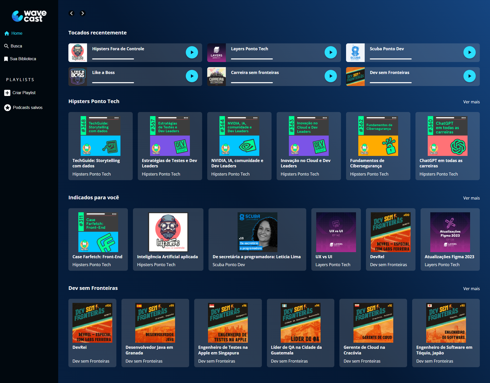

# WaveCast
 Site criado com HTML e CSS

Projeto feito durante a aula na plataforma Alura, criado utilizando HTML e CSS, com tecnicas de flexbox e display grid.

| :placard: Vitrine.Dev |     |
| -------------  | --- |
| :sparkles: Nome        | **WaveCast**
| :label: Tecnologias | HTML, CSS, grid, flexbox Figma
| :rocket: URL         | https://wave-cast-orcin.vercel.app/

<!-- Inserir imagem com a #vitrinedev ao final do link -->
